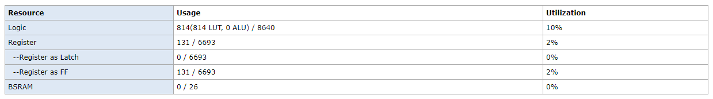

# Conway's Game of Life on FPGA

This project implements **Conway’s Game of Life with wrap-around boundary conditions** on an **8×8 LED matrix**, fully running on FPGA hardware.

The design is built and tested on the **Sipeed Tang Nano 9K FPGA board**, and uses real-time hardware multiplexing to display the evolving cellular automaton.

🔗 **FPGA Board Used:** [Sipeed Tang Nano 9K Wiki](https://wiki.sipeed.com/hardware/en/tang/Tang-Nano-9K/Nano-9K.html)

---

## 🎯 Project Overview
This is a hardware implementation of **Conway’s Game of Life**, where:

- each LED represents one cell
- ON = alive
- OFF = dead
- the grid evolves every second
- edges use **toroidal (wrap-around) boundary conditions**

The **initial condition is defined inside `main.v`**, allowing easy experimentation with different starting patterns.

This version uses **wrap-around edges**, meaning cells on one edge interact with cells on the opposite edge.

For example:

- top connects to bottom
- left connects to right
- corners wrap diagonally

This creates a **continuous toroidal world**.

🔗 **Reference:** [Conway's Game of Life – Wikipedia](https://en.wikipedia.org/wiki/Conway%27s_Game_of_Life)

---

## 🧠 Conway’s Game of Life Rules
The evolution follows the **standard Conway rules**, applied simultaneously to all cells.

For every cell:

### ✅ Survival
A live cell survives if it has:

- **2 live neighbours**
- **3 live neighbours**

### 🌱 Birth
A dead cell becomes alive if it has:

- **exactly 3 live neighbours**

### ❌ Death
In all other cases, the cell dies or remains dead.

These rules generate complex emergent behaviour from very simple logic.

---

## 🔄 Wrap-Around Boundary Conditions
Unlike a bounded grid, this implementation uses **wrap-around (toroidal) edges**.

This means:

- row `0` sees row `7` as its upper neighbour
- column `0` sees column `7` as its left neighbour
- all edge interactions continue seamlessly

This avoids edge death artifacts and creates smoother long-term evolution.

---

## 🧩 Module Breakdown

All Verilog/SystemVerilog source files are placed inside the **`src/` directory**.

### `src/Main.v`
This is the **Game of Life engine**.

Responsibilities:

- stores the 8×8 cell state
- computes next generation
- applies wrap-around Conway rules
- defines the **initial seed pattern**
- outputs a **64-bit flattened display buffer**

The initial state can be modified here to test:

- oscillators
- gliders
- still lifes
- random seeds

### `src/Matrix.v`
This module handles **LED matrix scanning and multiplexing**.

It:

- accepts a **64-bit input data bus**
- splits it into 8 rows
- scans rows at **1 kHz**
- refreshes the display fast enough to avoid visible flicker

This module is reusable for other 8×8 display projects.

### `src/Clock Divider.v`
This module derives lower frequencies from the **27 MHz onboard clock**.

It uses a **25-bit divider input** to generate:

- **1 Hz** → Game of Life progression
- **1 kHz** → row multiplexing clock

This separation ensures:

- smooth display refresh
- visible generation updates
- independent display and simulation timing

---

## 📷 Synthesis Report Snapshot
The following image shows the post-synthesis resource utilization from **Gowin Education IDE**.



---

## 💡 Hardware Used
### FPGA
- **Board:** Sipeed Tang Nano 9K
- **FPGA:** Gowin GW1NR-9
- **Clock:** 27 MHz onboard oscillator

🔗 Board Wiki:  
https://wiki.sipeed.com/hardware/en/tang/Tang-Nano-9K/Nano-9K.html

---

### LED Matrix
The display is driven using an **8×8 1088AS LED matrix module**.

- **Module:** 1088AS
- **Type:** 8×8 LED dot matrix
- **Drive Method:** row multiplexing

🔗 Datasheet:  
https://www.makerguides.com/wp-content/uploads/2020/06/1088AS-Datasheet.pdf

---

## 📁 File Structure
```text
Conway/
├── README.md
└── src/
    ├── Main.v
    ├── Matrix.v
    └── Clock Divider.v
